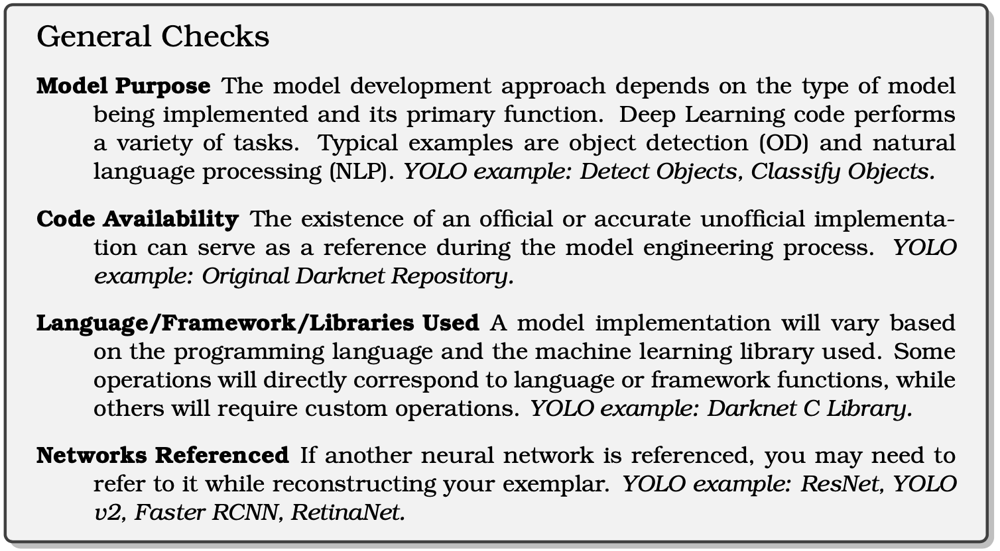
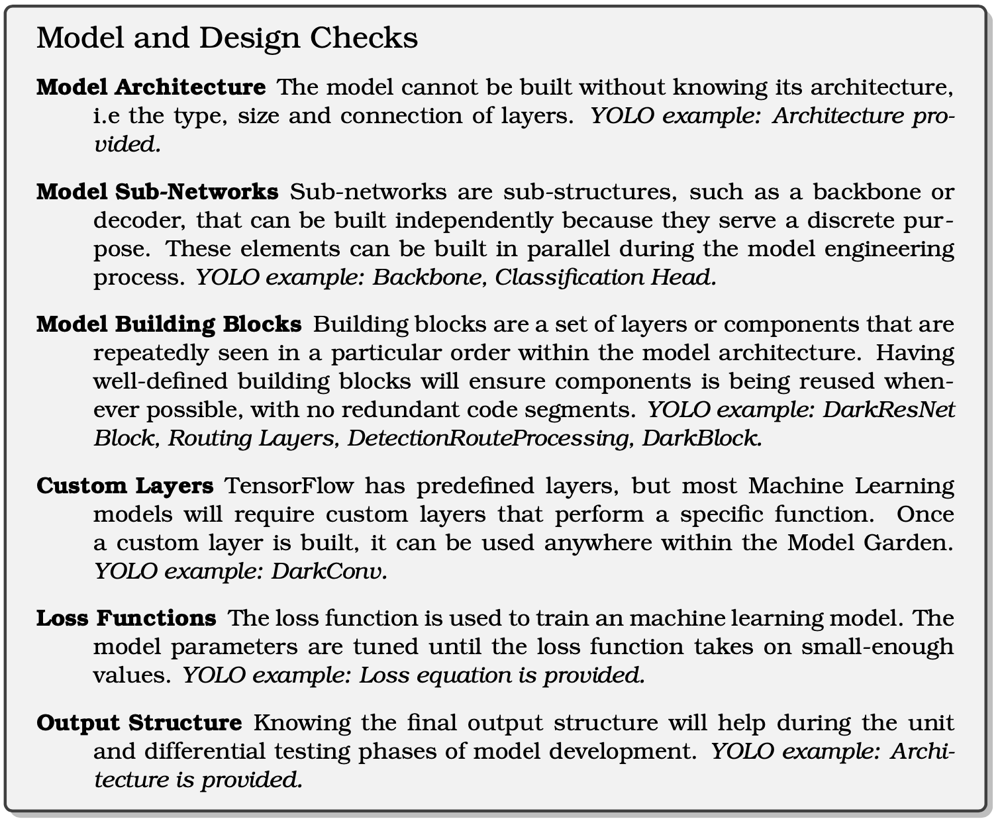
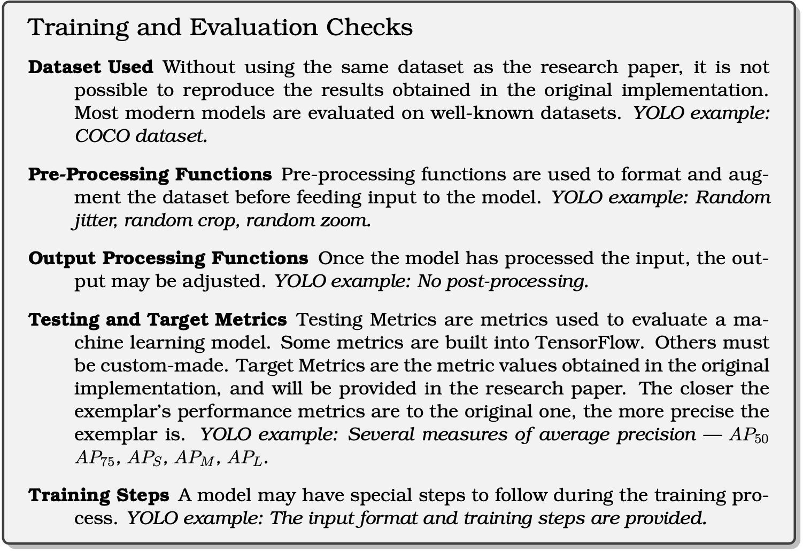

# Challenges and Practices of Deep Learning Model Reengineering: A Case Study on Computer Vision

This is the artifact for the submission to ICSE'2023. 

This artifact includes our data for:
- Open-source failure analysis:
  - The data collection method is presented in §5.1
  - The results are presented in §6.1-§6.4

- Leader interviews:
  - The data collection method is presented in §5.2
  - The results are presented in §6.5

- Reengineering checklists:
    
    
    
<!-- **For the spreadsheet, you may download to view it.* -->
