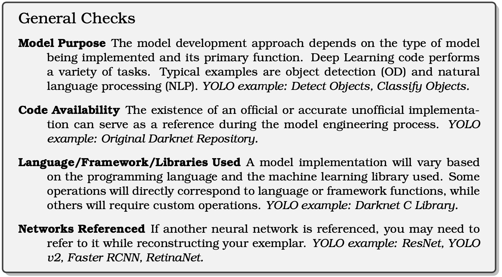
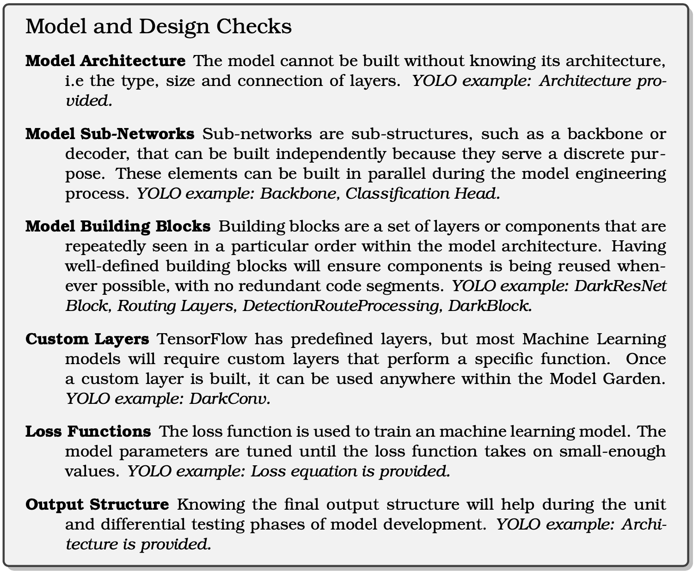
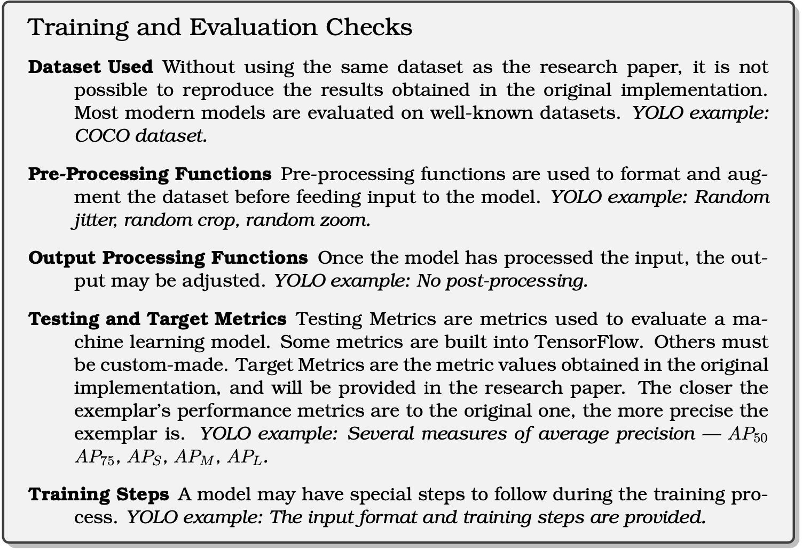

 # Leader interviews:
 This folder includes:
 - The interview protocol, including interview questions.
   - All the interviews are semi-structured.
 - The transcripts of 5 interviews (leader 2 and 3 are interviewed together).
   <!-- - Collaboration: -->
   - Leader 2, 3 collaborated (co-leaded) on the same project before.
   - All the other leaders seperately leaded at least one project before.
    - The transcription was performed automatically by service from [Rev](https://www.rev.com/).
  - Our checklist for deep learning reengineering tasks:
  
  
  

